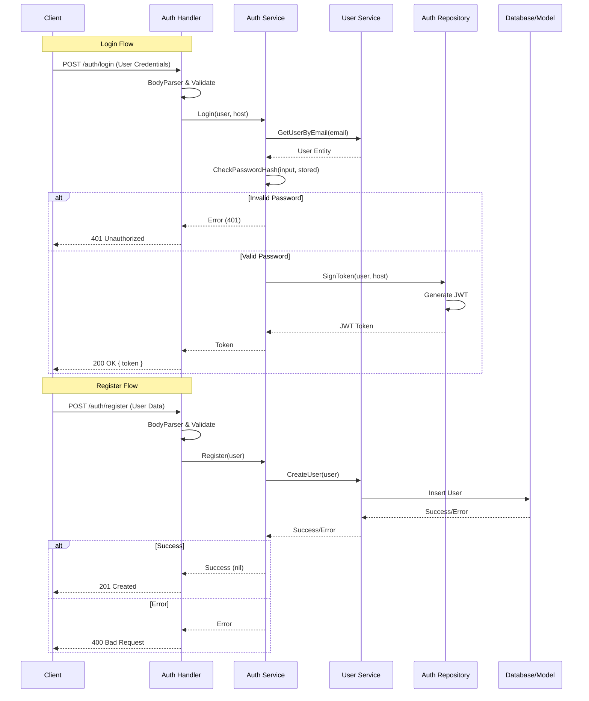

```mermaid
sequenceDiagram
    participant Client
    participant AH as Auth Handler
    participant AS as Auth Service
    participant US as User Service
    participant AR as Auth Repository
    participant DB as Database/Model

    note over Client, AH: Login Flow
    Client->>AH: POST /auth/login (User Credentials)
    AH->>AH: BodyParser & Validate
    AH->>AS: Login(user, host)
    AS->>US: GetUserByEmail(email)
    US-->>AS: User Entity
    AS->>AS: CheckPasswordHash(input, stored)

    alt Invalid Password
        AS-->>AH: Error (401)
        AH-->>Client: 401 Unauthorized
    else Valid Password
        AS->>AR: SignToken(user, host)
        AR->>AR: Generate JWT
        AR-->>AS: JWT Token
        AS-->>AH: Token
        AH-->>Client: 200 OK { token }
    end

    note over Client, AH: Register Flow
    Client->>AH: POST /auth/register (User Data)
    AH->>AH: BodyParser & Validate
    AH->>AS: Register(user)
    AS->>US: CreateUser(user)
    US->>DB: Insert User
    DB-->>US: Success/Error
    US-->>AS: Success/Error

    alt Success
        AS-->>AH: Success (nil)
        AH-->>Client: 201 Created
    else Error
        AS-->>AH: Error
        AH-->>Client: 400 Bad Request
    end
```
