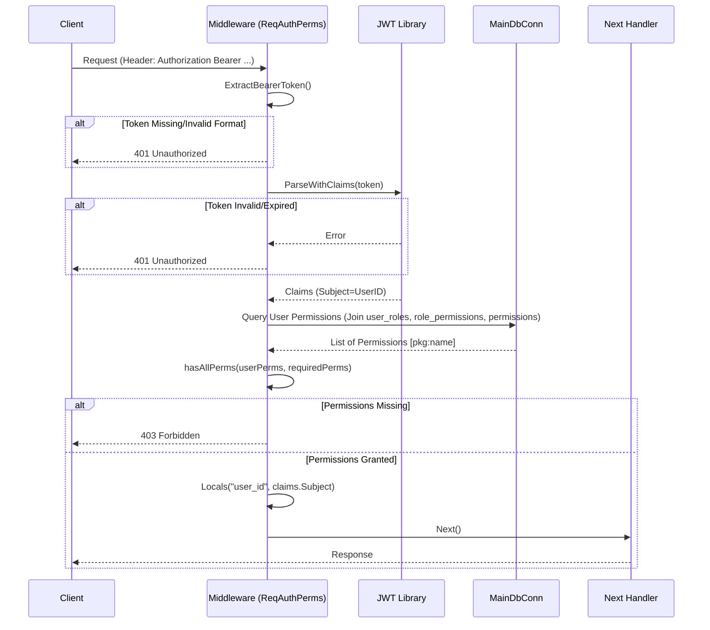

```mermaid
sequenceDiagram
    participant Client
    participant MW as Middleware (ReqAuthPerms)
    participant JWT as JWT Library
    participant DB as MainDbConn
    participant H as Next Handler

    Client->>MW: Request (Header: Authorization Bearer ...)
    MW->>MW: ExtractBearerToken()
    alt Token Missing/Invalid Format
        MW-->>Client: 401 Unauthorized
    end

    MW->>JWT: ParseWithClaims(token)
    alt Token Invalid/Expired
        JWT-->>MW: Error
        MW-->>Client: 401 Unauthorized
    end

    JWT-->>MW: Claims (Subject=UserID)

    MW->>DB: Query User Permissions (Join user_roles, role_permissions, permissions)
    DB-->>MW: List of Permissions [pkg:name]

    MW->>MW: hasAllPerms(userPerms, requiredPerms)
    alt Permissions Missing
        MW-->>Client: 403 Forbidden
    else Permissions Granted
        MW->>MW: Locals("user_id", claims.Subject)
        MW->>H: Next()
        H-->>Client: Response
    end
```
