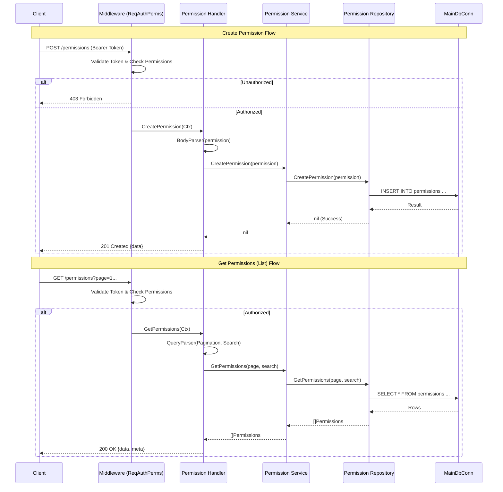

```mermaid
sequenceDiagram
    participant Client
    participant MW as Middleware (ReqAuthPerms)
    participant H as Permission Handler
    participant S as Permission Service
    participant R as Permission Repository
    participant DB as MainDbConn

    note over Client, DB: Create Permission Flow
    Client->>MW: POST /permissions (Bearer Token)
    MW->>MW: Validate Token & Check Permissions
    alt Unauthorized
        MW-->>Client: 403 Forbidden
    else Authorized
        MW->>H: CreatePermission(Ctx)
        H->>H: BodyParser(permission)
        H->>S: CreatePermission(permission)
        S->>R: CreatePermission(permission)
        R->>DB: INSERT INTO permissions ...
        DB-->>R: Result
        R-->>S: nil (Success)
        S-->>H: nil
        H-->>Client: 201 Created {data}
    end

    note over Client, DB: Get Permissions (List) Flow
    Client->>MW: GET /permissions?page=1...
    MW->>MW: Validate Token & Check Permissions
    alt Authorized
        MW->>H: GetPermissions(Ctx)
        H->>H: QueryParser(Pagination, Search)
        H->>S: GetPermissions(page, search)
        S->>R: GetPermissions(page, search)
        R->>DB: SELECT * FROM permissions ...
        DB-->>R: Rows
        R-->>S: []Permissions
        S-->>H: []Permissions
        H-->>Client: 200 OK {data, meta}
    end
```
