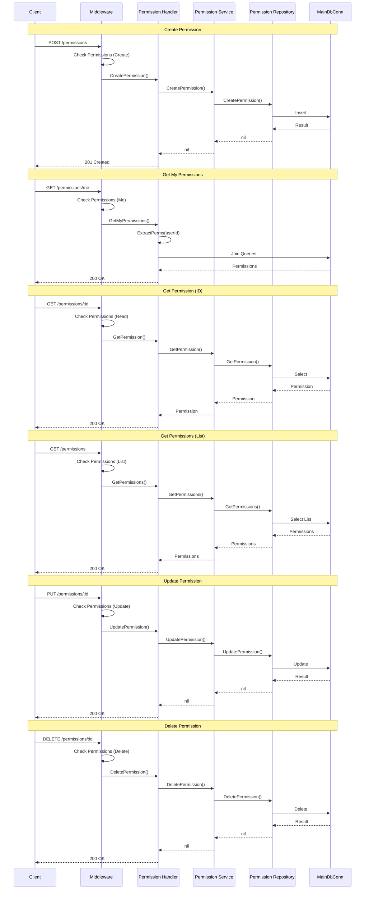

```mermaid
sequenceDiagram
    participant Client
    participant MW as Middleware
    participant H as Permission Handler
    participant S as Permission Service
    participant R as Permission Repository
    participant DB as MainDbConn

    note over Client, DB: Create Permission
    Client->>MW: POST /permissions
    MW->>MW: Check Permissions (Create)
    MW->>H: CreatePermission()
    H->>S: CreatePermission()
    S->>R: CreatePermission()
    R->>DB: Insert
    DB-->>R: Result
    R-->>S: nil
    S-->>H: nil
    H-->>Client: 201 Created

    note over Client, DB: Get My Permissions
    Client->>MW: GET /permissions/me
    MW->>MW: Check Permissions (Me)
    MW->>H: GetMyPermissions()
    H->>H: ExtractPerms(userId)
    H->>DB: Join Queries
    DB-->>H: Permissions
    H-->>Client: 200 OK

    note over Client, DB: Get Permission (ID)
    Client->>MW: GET /permissions/:id
    MW->>MW: Check Permissions (Read)
    MW->>H: GetPermission()
    H->>S: GetPermission()
    S->>R: GetPermission()
    R->>DB: Select
    DB-->>R: Permission
    R-->>S: Permission
    S-->>H: Permission
    H-->>Client: 200 OK

    note over Client, DB: Get Permissions (List)
    Client->>MW: GET /permissions
    MW->>MW: Check Permissions (List)
    MW->>H: GetPermissions()
    H->>S: GetPermissions()
    S->>R: GetPermissions()
    R->>DB: Select List
    DB-->>R: Permissions
    R-->>S: Permissions
    S-->>H: Permissions
    H-->>Client: 200 OK

    note over Client, DB: Update Permission
    Client->>MW: PUT /permissions/:id
    MW->>MW: Check Permissions (Update)
    MW->>H: UpdatePermission()
    H->>S: UpdatePermission()
    S->>R: UpdatePermission()
    R->>DB: Update
    DB-->>R: Result
    R-->>S: nil
    S-->>H: nil
    H-->>Client: 200 OK

    note over Client, DB: Delete Permission
    Client->>MW: DELETE /permissions/:id
    MW->>MW: Check Permissions (Delete)
    MW->>H: DeletePermission()
    H->>S: DeletePermission()
    S->>R: DeletePermission()
    R->>DB: Delete
    DB-->>R: Result
    R-->>S: nil
    S-->>H: nil
    H-->>Client: 200 OK
```
