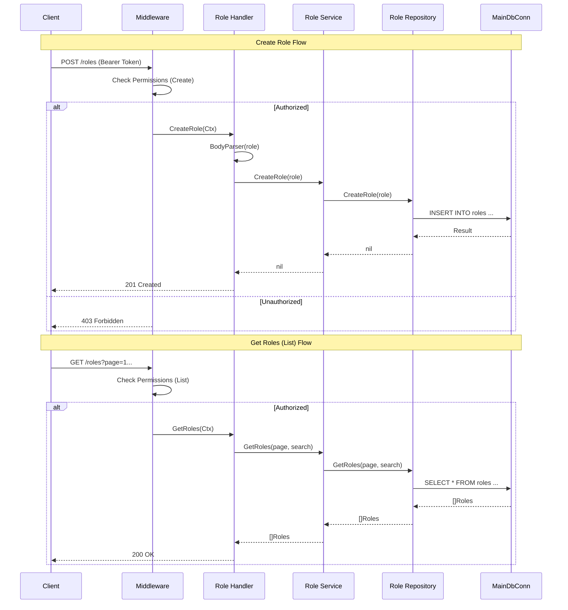

```mermaid
sequenceDiagram
    participant Client
    participant MW as Middleware
    participant H as Role Handler
    participant S as Role Service
    participant R as Role Repository
    participant DB as MainDbConn

    note over Client, DB: Create Role Flow
    Client->>MW: POST /roles (Bearer Token)
    MW->>MW: Check Permissions (Create)
    alt Authorized
        MW->>H: CreateRole(Ctx)
        H->>H: BodyParser(role)
        H->>S: CreateRole(role)
        S->>R: CreateRole(role)
        R->>DB: INSERT INTO roles ...
        DB-->>R: Result
        R-->>S: nil
        S-->>H: nil
        H-->>Client: 201 Created
    else Unauthorized
        MW-->>Client: 403 Forbidden
    end

    note over Client, DB: Get Roles (List) Flow
    Client->>MW: GET /roles?page=1...
    MW->>MW: Check Permissions (List)
    alt Authorized
        MW->>H: GetRoles(Ctx)
        H->>S: GetRoles(page, search)
        S->>R: GetRoles(page, search)
        R->>DB: SELECT * FROM roles ...
        DB-->>R: []Roles
        R-->>S: []Roles
        S-->>H: []Roles
        H-->>Client: 200 OK
    end
```
