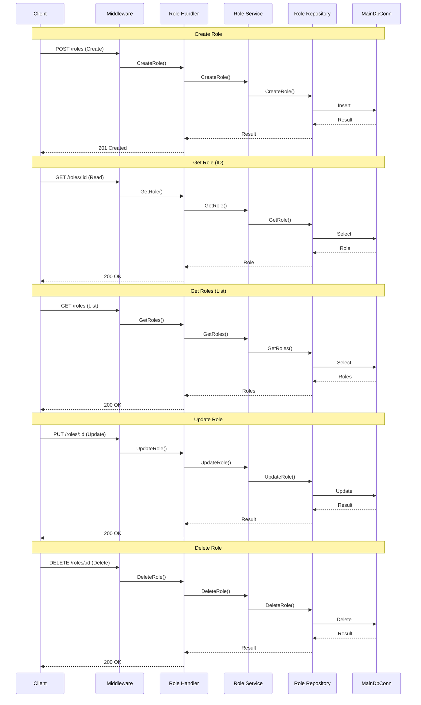

```mermaid
sequenceDiagram
    participant Client
    participant MW as Middleware
    participant H as Role Handler
    participant S as Role Service
    participant R as Role Repository
    participant DB as MainDbConn

    note over Client, DB: Create Role
    Client->>MW: POST /roles (Create)
    MW->>H: CreateRole()
    H->>S: CreateRole()
    S->>R: CreateRole()
    R->>DB: Insert
    DB-->>R: Result
    R-->>H: Result
    H-->>Client: 201 Created

    note over Client, DB: Get Role (ID)
    Client->>MW: GET /roles/:id (Read)
    MW->>H: GetRole()
    H->>S: GetRole()
    S->>R: GetRole()
    R->>DB: Select
    DB-->>R: Role
    R-->>H: Role
    H-->>Client: 200 OK

    note over Client, DB: Get Roles (List)
    Client->>MW: GET /roles (List)
    MW->>H: GetRoles()
    H->>S: GetRoles()
    S->>R: GetRoles()
    R->>DB: Select
    DB-->>R: Roles
    R-->>H: Roles
    H-->>Client: 200 OK

    note over Client, DB: Update Role
    Client->>MW: PUT /roles/:id (Update)
    MW->>H: UpdateRole()
    H->>S: UpdateRole()
    S->>R: UpdateRole()
    R->>DB: Update
    DB-->>R: Result
    R-->>H: Result
    H-->>Client: 200 OK

    note over Client, DB: Delete Role
    Client->>MW: DELETE /roles/:id (Delete)
    MW->>H: DeleteRole()
    H->>S: DeleteRole()
    S->>R: DeleteRole()
    R->>DB: Delete
    DB-->>R: Result
    R-->>H: Result
    H-->>Client: 200 OK
```
