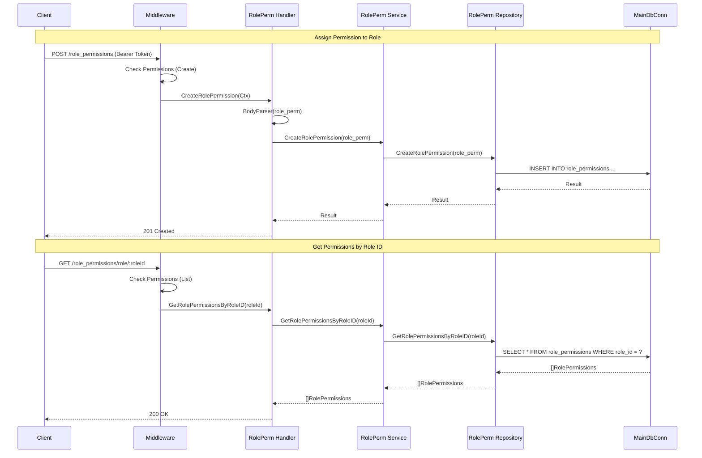

```mermaid
sequenceDiagram
    participant Client
    participant MW as Middleware
    participant H as RolePerm Handler
    participant S as RolePerm Service
    participant R as RolePerm Repository
    participant DB as MainDbConn

    note over Client, DB: Assign Permission to Role
    Client->>MW: POST /role_permissions (Bearer Token)
    MW->>MW: Check Permissions (Create)

    MW->>H: CreateRolePermission(Ctx)
    H->>H: BodyParser(role_perm)
    H->>S: CreateRolePermission(role_perm)
    S->>R: CreateRolePermission(role_perm)
    R->>DB: INSERT INTO role_permissions ...
    DB-->>R: Result
    R-->>S: Result
    S-->>H: Result
    H-->>Client: 201 Created

    note over Client, DB: Get Permissions by Role ID
    Client->>MW: GET /role_permissions/role/:roleId
    MW->>MW: Check Permissions (List)

    MW->>H: GetRolePermissionsByRoleID(roleId)
    H->>S: GetRolePermissionsByRoleID(roleId)
    S->>R: GetRolePermissionsByRoleID(roleId)
    R->>DB: SELECT * FROM role_permissions WHERE role_id = ?
    DB-->>R: []RolePermissions
    R-->>S: []RolePermissions
    S-->>H: []RolePermissions
    H-->>Client: 200 OK
```
