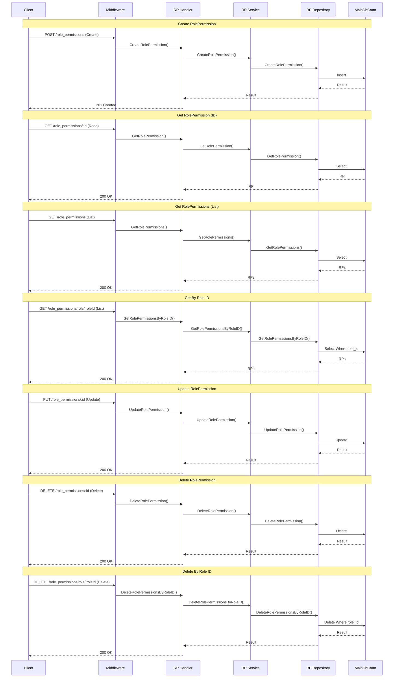

```mermaid
sequenceDiagram
    participant Client
    participant MW as Middleware
    participant H as RP Handler
    participant S as RP Service
    participant R as RP Repository
    participant DB as MainDbConn

    note over Client, DB: Create RolePermission
    Client->>MW: POST /role_permissions (Create)
    MW->>H: CreateRolePermission()
    H->>S: CreateRolePermission()
    S->>R: CreateRolePermission()
    R->>DB: Insert
    DB-->>R: Result
    R-->>H: Result
    H-->>Client: 201 Created

    note over Client, DB: Get RolePermission (ID)
    Client->>MW: GET /role_permissions/:id (Read)
    MW->>H: GetRolePermission()
    H->>S: GetRolePermission()
    S->>R: GetRolePermission()
    R->>DB: Select
    DB-->>R: RP
    R-->>H: RP
    H-->>Client: 200 OK

    note over Client, DB: Get RolePermissions (List)
    Client->>MW: GET /role_permissions (List)
    MW->>H: GetRolePermissions()
    H->>S: GetRolePermissions()
    S->>R: GetRolePermissions()
    R->>DB: Select
    DB-->>R: RPs
    R-->>H: RPs
    H-->>Client: 200 OK

    note over Client, DB: Get By Role ID
    Client->>MW: GET /role_permissions/role/:roleId (List)
    MW->>H: GetRolePermissionsByRoleID()
    H->>S: GetRolePermissionsByRoleID()
    S->>R: GetRolePermissionsByRoleID()
    R->>DB: Select Where role_id
    DB-->>R: RPs
    R-->>H: RPs
    H-->>Client: 200 OK

    note over Client, DB: Update RolePermission
    Client->>MW: PUT /role_permissions/:id (Update)
    MW->>H: UpdateRolePermission()
    H->>S: UpdateRolePermission()
    S->>R: UpdateRolePermission()
    R->>DB: Update
    DB-->>R: Result
    R-->>H: Result
    H-->>Client: 200 OK

    note over Client, DB: Delete RolePermission
    Client->>MW: DELETE /role_permissions/:id (Delete)
    MW->>H: DeleteRolePermission()
    H->>S: DeleteRolePermission()
    S->>R: DeleteRolePermission()
    R->>DB: Delete
    DB-->>R: Result
    R-->>H: Result
    H-->>Client: 200 OK

    note over Client, DB: Delete By Role ID
    Client->>MW: DELETE /role_permissions/role/:roleId (Delete)
    MW->>H: DeleteRolePermissionsByRoleID()
    H->>S: DeleteRolePermissionsByRoleID()
    S->>R: DeleteRolePermissionsByRoleID()
    R->>DB: Delete Where role_id
    DB-->>R: Result
    R-->>H: Result
    H-->>Client: 200 OK
```
