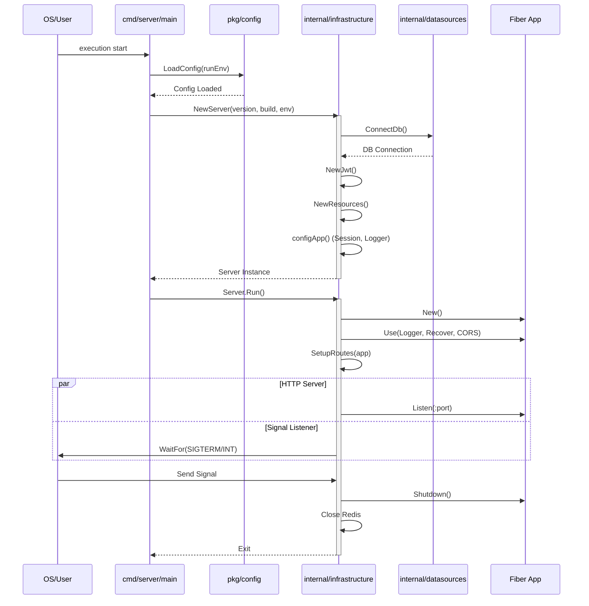

```mermaid
sequenceDiagram
    participant OS as OS/User
    participant Main as cmd/server/main
    participant Config as pkg/config
    participant Infra as internal/infrastructure
    participant DS as internal/datasources
    participant Fiber as Fiber App

    OS->>Main: execution start
    Main->>Config: LoadConfig(runEnv)
    Config-->>Main: Config Loaded

    Main->>Infra: NewServer(version, build, env)
    activate Infra
    Infra->>DS: ConnectDb()
    DS-->>Infra: DB Connection
    Infra->>Infra: NewJwt()
    Infra->>Infra: NewResources()
    Infra->>Infra: configApp() (Session, Logger)
    Infra-->>Main: Server Instance
    deactivate Infra

    Main->>Infra: Server.Run()
    activate Infra
    Infra->>Fiber: New()
    Infra->>Fiber: Use(Logger, Recover, CORS)
    Infra->>Infra: SetupRoutes(app)

    par HTTP Server
        Infra->>Fiber: Listen(:port)
    and Signal Listener
        Infra->>OS: WaitFor(SIGTERM/INT)
    end

    OS->>Infra: Send Signal
    Infra->>Fiber: Shutdown()
    Infra->>Infra: Close Redis
    Infra-->>Main: Exit
    deactivate Infra
```
