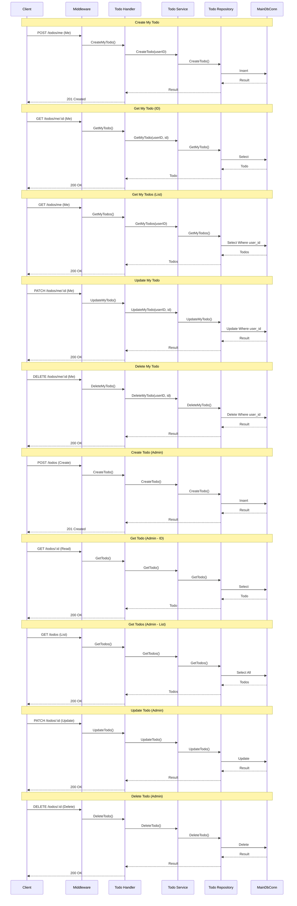

```mermaid
sequenceDiagram
    participant Client
    participant MW as Middleware
    participant H as Todo Handler
    participant S as Todo Service
    participant R as Todo Repository
    participant DB as MainDbConn

    note over Client, DB: Create My Todo
    Client->>MW: POST /todos/me (Me)
    MW->>H: CreateMyTodo()
    H->>S: CreateTodo(userID)
    S->>R: CreateTodo()
    R->>DB: Insert
    DB-->>R: Result
    R-->>H: Result
    H-->>Client: 201 Created

    note over Client, DB: Get My Todo (ID)
    Client->>MW: GET /todos/me/:id (Me)
    MW->>H: GetMyTodo()
    H->>S: GetMyTodo(userID, id)
    S->>R: GetMyTodo()
    R->>DB: Select
    DB-->>R: Todo
    R-->>H: Todo
    H-->>Client: 200 OK

    note over Client, DB: Get My Todos (List)
    Client->>MW: GET /todos/me (Me)
    MW->>H: GetMyTodos()
    H->>S: GetMyTodos(userID)
    S->>R: GetMyTodos()
    R->>DB: Select Where user_id
    DB-->>R: Todos
    R-->>H: Todos
    H-->>Client: 200 OK

    note over Client, DB: Update My Todo
    Client->>MW: PATCH /todos/me/:id (Me)
    MW->>H: UpdateMyTodo()
    H->>S: UpdateMyTodo(userID, id)
    S->>R: UpdateMyTodo()
    R->>DB: Update Where user_id
    DB-->>R: Result
    R-->>H: Result
    H-->>Client: 200 OK

    note over Client, DB: Delete My Todo
    Client->>MW: DELETE /todos/me/:id (Me)
    MW->>H: DeleteMyTodo()
    H->>S: DeleteMyTodo(userID, id)
    S->>R: DeleteMyTodo()
    R->>DB: Delete Where user_id
    DB-->>R: Result
    R-->>H: Result
    H-->>Client: 200 OK

    note over Client, DB: Create Todo (Admin)
    Client->>MW: POST /todos (Create)
    MW->>H: CreateTodo()
    H->>S: CreateTodo()
    S->>R: CreateTodo()
    R->>DB: Insert
    DB-->>R: Result
    R-->>H: Result
    H-->>Client: 201 Created

    note over Client, DB: Get Todo (Admin - ID)
    Client->>MW: GET /todos/:id (Read)
    MW->>H: GetTodo()
    H->>S: GetTodo()
    S->>R: GetTodo()
    R->>DB: Select
    DB-->>R: Todo
    R-->>H: Todo
    H-->>Client: 200 OK

    note over Client, DB: Get Todos (Admin - List)
    Client->>MW: GET /todos (List)
    MW->>H: GetTodos()
    H->>S: GetTodos()
    S->>R: GetTodos()
    R->>DB: Select All
    DB-->>R: Todos
    R-->>H: Todos
    H-->>Client: 200 OK

    note over Client, DB: Update Todo (Admin)
    Client->>MW: PATCH /todos/:id (Update)
    MW->>H: UpdateTodo()
    H->>S: UpdateTodo()
    S->>R: UpdateTodo()
    R->>DB: Update
    DB-->>R: Result
    R-->>H: Result
    H-->>Client: 200 OK

    note over Client, DB: Delete Todo (Admin)
    Client->>MW: DELETE /todos/:id (Delete)
    MW->>H: DeleteTodo()
    H->>S: DeleteTodo()
    S->>R: DeleteTodo()
    R->>DB: Delete
    DB-->>R: Result
    R-->>H: Result
    H-->>Client: 200 OK
```
