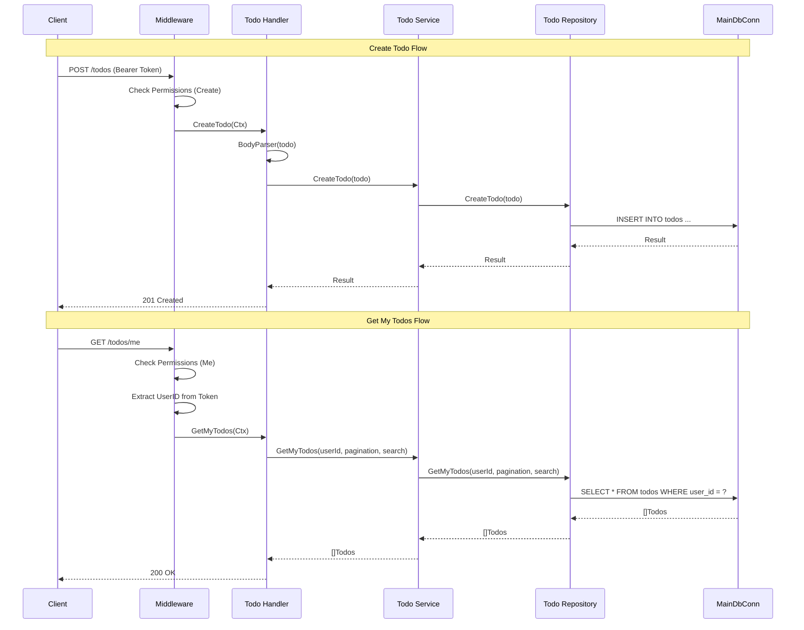

```mermaid
sequenceDiagram
    participant Client
    participant MW as Middleware
    participant H as Todo Handler
    participant S as Todo Service
    participant R as Todo Repository
    participant DB as MainDbConn

    note over Client, DB: Create Todo Flow
    Client->>MW: POST /todos (Bearer Token)
    MW->>MW: Check Permissions (Create)

    MW->>H: CreateTodo(Ctx)
    H->>H: BodyParser(todo)
    H->>S: CreateTodo(todo)
    S->>R: CreateTodo(todo)
    R->>DB: INSERT INTO todos ...
    DB-->>R: Result
    R-->>S: Result
    S-->>H: Result
    H-->>Client: 201 Created

    note over Client, DB: Get My Todos Flow
    Client->>MW: GET /todos/me
    MW->>MW: Check Permissions (Me)
    MW->>MW: Extract UserID from Token

    MW->>H: GetMyTodos(Ctx)
    H->>S: GetMyTodos(userId, pagination, search)
    S->>R: GetMyTodos(userId, pagination, search)
    R->>DB: SELECT * FROM todos WHERE user_id = ?
    DB-->>R: []Todos
    R-->>S: []Todos
    S-->>H: []Todos
    H-->>Client: 200 OK
```
