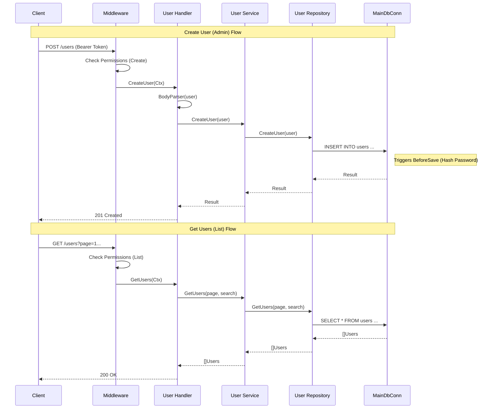

```mermaid
sequenceDiagram
    participant Client
    participant MW as Middleware
    participant H as User Handler
    participant S as User Service
    participant R as User Repository
    participant DB as MainDbConn

    note over Client, DB: Create User (Admin) Flow
    Client->>MW: POST /users (Bearer Token)
    MW->>MW: Check Permissions (Create)

    MW->>H: CreateUser(Ctx)
    H->>H: BodyParser(user)
    H->>S: CreateUser(user)
    S->>R: CreateUser(user)
    R->>DB: INSERT INTO users ...
    note right of DB: Triggers BeforeSave (Hash Password)
    DB-->>R: Result
    R-->>S: Result
    S-->>H: Result
    H-->>Client: 201 Created

    note over Client, DB: Get Users (List) Flow
    Client->>MW: GET /users?page=1...
    MW->>MW: Check Permissions (List)

    MW->>H: GetUsers(Ctx)
    H->>S: GetUsers(page, search)
    S->>R: GetUsers(page, search)
    R->>DB: SELECT * FROM users ...
    DB-->>R: []Users
    R-->>S: []Users
    S-->>H: []Users
    H-->>Client: 200 OK
```
