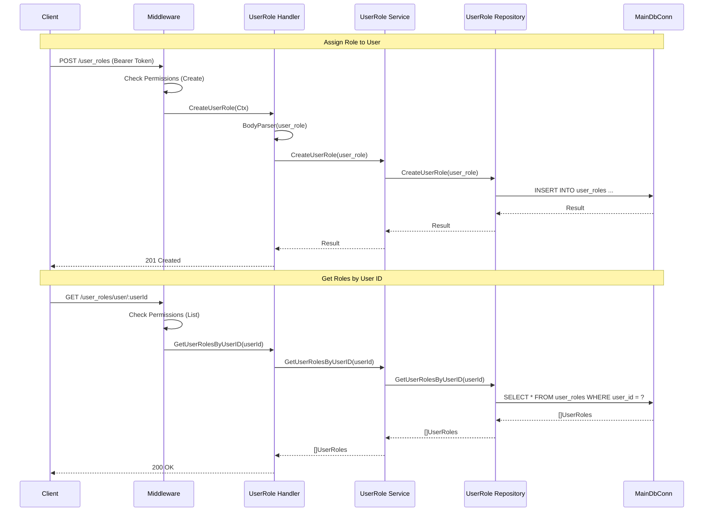

```mermaid
sequenceDiagram
    participant Client
    participant MW as Middleware
    participant H as UserRole Handler
    participant S as UserRole Service
    participant R as UserRole Repository
    participant DB as MainDbConn

    note over Client, DB: Assign Role to User
    Client->>MW: POST /user_roles (Bearer Token)
    MW->>MW: Check Permissions (Create)

    MW->>H: CreateUserRole(Ctx)
    H->>H: BodyParser(user_role)
    H->>S: CreateUserRole(user_role)
    S->>R: CreateUserRole(user_role)
    R->>DB: INSERT INTO user_roles ...
    DB-->>R: Result
    R-->>S: Result
    S-->>H: Result
    H-->>Client: 201 Created

    note over Client, DB: Get Roles by User ID
    Client->>MW: GET /user_roles/user/:userId
    MW->>MW: Check Permissions (List)

    MW->>H: GetUserRolesByUserID(userId)
    H->>S: GetUserRolesByUserID(userId)
    S->>R: GetUserRolesByUserID(userId)
    R->>DB: SELECT * FROM user_roles WHERE user_id = ?
    DB-->>R: []UserRoles
    R-->>S: []UserRoles
    S-->>H: []UserRoles
    H-->>Client: 200 OK
```
